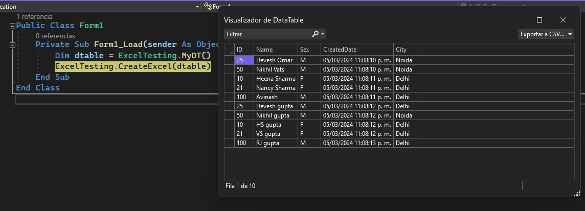
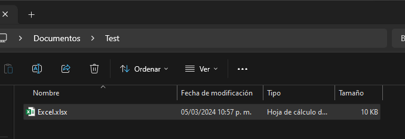
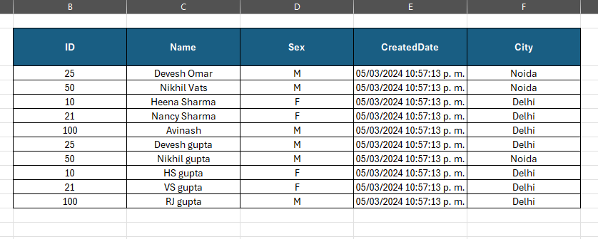

# ExcelCreation
Net framework. Create an Excel file with a datatable content without use any libraries.

Use Excel.application object of the classic visual basic, you can create a dll and integrate this functionality with netframeworks languages like C# or VBNET

## Result







## Code

```vba
Public Shared Sub CreateExcel(dtable As DataTable)
        Try
            '-------------- Set necessary variables
            Dim ExcelApp As Object
            ExcelApp = CreateObject("Excel.Application")

            Dim wb As Object
            wb = ExcelApp.Workbooks.Add

            Dim sheet As Object
            sheet = wb.Worksheets(1)

            Dim rowAdjust As Integer = 1 'Set content next to headers
            Dim excelCell As String = "B2"


            ' -------------- Write Content
            ' Set Headers
            For col = 0 To dtable.Columns.Count - 1
                sheet.Range(excelCell).Offset(0, col).Value = dtable.Columns.Item(col).ColumnName
            Next

            ' Set the content of the datatable
            For row = 0 To dtable.Rows.Count - 1
                For col = 0 To dtable.Columns.Count - 1
                    'sheet.Cells(row + 1, col + 1).Value = dtable.Rows(row).Item(col)
                    sheet.Range(excelCell).Offset(row + rowAdjust, col).Value = dtable.Rows(row).Item(col)
                Next col
            Next row

            ' --------------- Set style
            ' Header Style
            With sheet.Range(sheet.Range(excelCell),
                             sheet.Range(excelCell).Offset(0, dtable.Columns.Count - 1))
                .WrapText = True
                .RowHeight = 40
                .ColumnWidth = 22
                .VerticalAlignment = -4108 'CENTER
                .HorizontalAlignment = -4108
                .Interior.Color = RGB(25, 94, 131)
                .Font.Bold = True
                .Font.Color = RGB(255, 255, 255) 'WHITE
            End With

            ' Border style
            With sheet.Range(sheet.Range(excelCell),
                             sheet.Range(excelCell).Offset(dtable.Rows.Count, dtable.Columns.Count - 1))
                .VerticalAlignment = -4108 'CENTER
                .HorizontalAlignment = -4108
                With .Borders
                    .LineStyle = 1 'xlContinuous
                End With
            End With

            ' --------------- Save Result
            Dim ruta = My.Computer.FileSystem.SpecialDirectories.MyDocuments
            wb.SaveAs(Path.Combine(ruta, "Test", "Excel.xlsx"))
            wb.Close
            ExcelApp.Quit()
        Catch ex As Exception
            MessageBox.Show(ex.ToString())
        End Try

    End Sub
```

